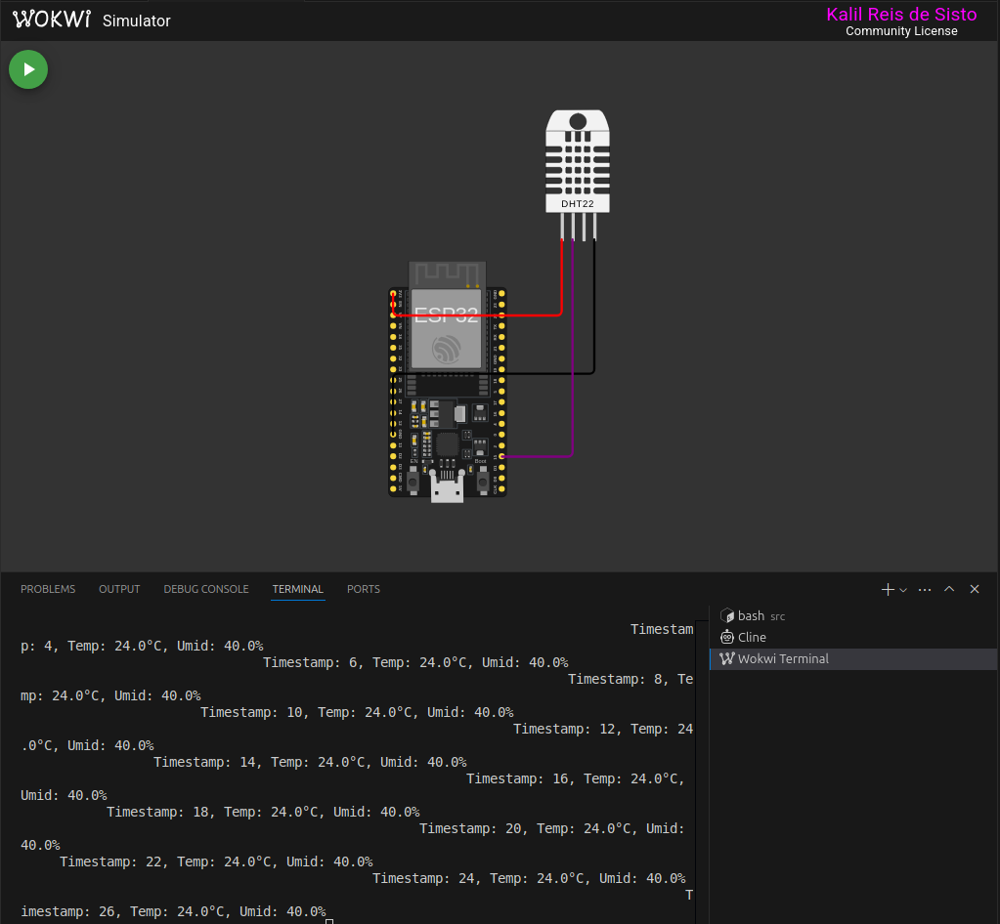
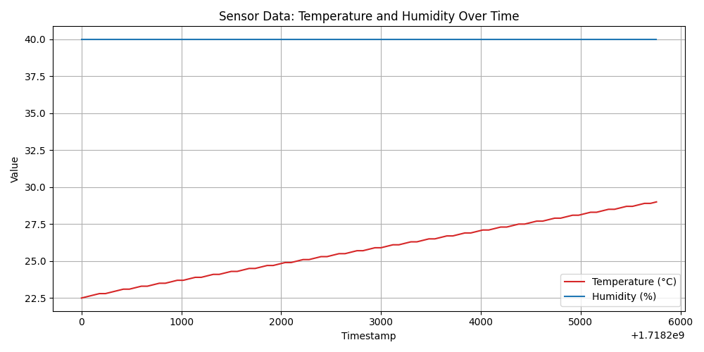

# FIAP - Faculdade de Informática e Administração Paulista

<p align="center">
<a href= "https://www.fiap.com.br/"></a>
</p>

<br>

# Nome do projeto

## Nome do grupo

## 👨‍🎓 Integrantes:

- <a href="https://github.com/kalilReis">Kalil Reis de Sisto</a>

## 👩‍🏫 Professores:

### Tutor(a)

- <a href="https://www.linkedin.com/company/inova-fusca">Leonardo Ruiz Orabona
  </a>

### Coordenador(a)

- <a href="https://www.linkedin.com/company/inova-fusca">André Godoy acho</a>

## 📜 Descrição

O projeto tem como objetivo coletar, através de sensores, as informações de temperatura e umidade de uma determinada máquina. Após a coleta, um gráfico será gerado demonstrando o resultado dessas medições ao longo do tempo.

**Imagem do Circuito**



**Temperatura e Humidade através do tempo**



## 📁 Estrutura de pastas

Dentre os arquivos e pastas presentes na raiz do projeto, definem-se:

- <b>assets</b>: aqui estão os arquivos relacionados a elementos não-estruturados deste repositório, como imagens.

- <b>document</b>: aqui estão todos os documentos do projeto que as atividades poderão pedir. Na subpasta "other", adicione documentos complementares e menos importantes.

- <b>src</b>: Todo o código fonte criado para o desenvolvimento do projeto ao longo das 7 fases.

- <b>README.md</b>: arquivo que serve como guia e explicação geral sobre o projeto (o mesmo que você está lendo agora).

## 🔧 Como executar o código

Siga os passos abaixo para instalar as dependências e executar o script Python de coleta e plotagem dos dados:

1. Crie um ambiente virtual (recomendado):

   ```bash
   python3 -m venv .venv
   ```

2. Ative o ambiente virtual:

   - No Linux/Mac:
     ```bash
     source .venv/bin/activate
     ```
   - No Windows:
     ```cmd
     .venv\Scripts\activate
     ```

3. Instale as dependências:

   ```bash
   pip install -r requirements.txt
   ```

4. Execute o script de plotagem dos dados:
   ```bash
   python src/plot_sensor_data.py
   ```

O script irá ler os dados do arquivo `simulated_sensor_data.csv` e gerar o gráfico correspondente, que será salvo como `sensor_data_plot.png` na pasta `assets`.

---

### Simulação do sensor com Wokwi e PlatformIO

Você pode simular o funcionamento do sensor e do circuito utilizando as extensões [Wokwi](https://marketplace.visualstudio.com/items?itemName=Wokwi.wokwi-vscode) e [PlatformIO](https://marketplace.visualstudio.com/items?itemName=platformio.platformio-ide) no VSCode.

**Passos para simular:**

1. Instale as extensões Wokwi e PlatformIO no VSCode.
2. Abra o projeto no VSCode.
3. Para simular o circuito no Wokwi:
   - Abra o arquivo `wokwi.toml`.
   - Clique no botão "Start Simulation" (ícone ▶️) na barra do Wokwi ou utilize o comando "Wokwi: Start Simulation" na paleta de comandos.
4. Para compilar e enviar o firmware para a placa virtual usando PlatformIO:
   - Certifique-se de que o arquivo `platformio.ini` está configurado corretamente.
   - Abra o arquivo `src/main.cpp` para visualizar/editar o código do microcontrolador.
   - Na barra do PlatformIO, clique em "Build" para compilar ou "Upload" para enviar para a placa (real ou simulada).
   - Você pode acompanhar a saída pelo terminal integrado do VSCode.

Essas ferramentas permitem testar o código e o circuito de forma virtual, facilitando o desenvolvimento e a validação do projeto sem a necessidade de hardware físico.

## 🗃 Histórico de lançamentos

- ## 0.5.0 - XX/XX/2024
- ## 0.4.0 - XX/XX/2024
- ## 0.3.0 - XX/XX/2024
- ## 0.2.0 - XX/XX/2024
- ## 0.1.0 - XX/XX/2024

## 📋 Licença

<p xmlns:cc="http://creativecommons.org/ns#" xmlns:dct="http://purl.org/dc/terms/"><a property="dct:title" rel="cc:attributionURL" href="https://github.com/agodoi/template">MODELO GIT FIAP</a> por <a rel="cc:attributionURL dct:creator" property="cc:attributionName" href="https://fiap.com.br">Fiap</a> está licenciado sobre <a href="http://creativecommons.org/licenses/by/4.0/?ref=chooser-v1" target="_blank" rel="license noopener noreferrer" style="display:inline-block;">Attribution 4.0 International</a>.</p>
